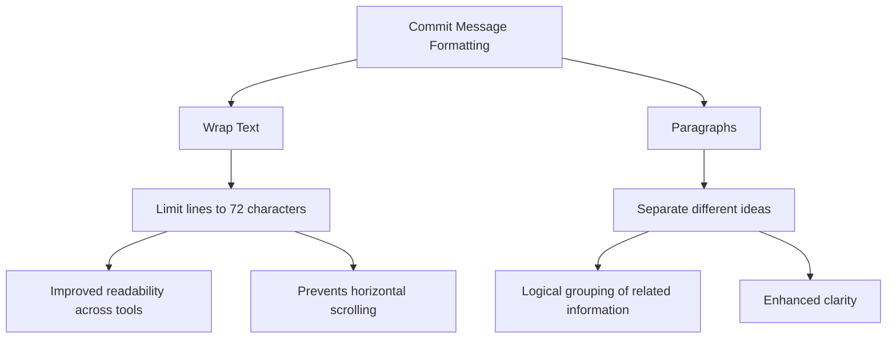

# Enhanced Commit Message Guidelines

A well-crafted commit message not only documents changes but also provides context for future maintainers. Follow these guidelines to create commit messages that are concise, informative, and aligned with project standards.

---

## 1. Commit Types

Start your commit message with a type that categorizes the change. Use one of the following:

- **`feat`**: Introducing a new feature.
- **`fix`**: Correcting a bug.
- **`docs`**: Updating or improving documentation.
- **`style`**: Formatting changes (e.g., code style, missing semicolons) that do not affect functionality.
- **`refactor`**: Code changes that improve structure or design without adding features or fixing bugs.
- **`perf`**: Enhancements that improve performance.
- **`test`**: Adding or modifying tests.
- **`chore`**: Maintenance tasks (e.g., dependency updates, build script modifications).

---

## 2. Overall Structure

A commit message should consist of the following parts:

1. **Subject Line**
2. **Optional Body**
3. **Optional Footer (for references and breaking changes)**

Ensure there is a blank line between each part.

---

## 3. Subject Line

The subject line is the first and most visible part of your commit message. Follow these rules:

Must add scope to the subject line.

- **Format:**  
  `<type>(<scope>): <brief description>`
  
- **Guidelines:**
  - **Imperative Mood:** Use commands such as "Add", "Fix", "Remove" (e.g., “Add JWT authentication”).
  - **Concise:** Limit to 50 characters.
  - **Capitalization:** Start with a capital letter.
  - **Punctuation:** Do not end with a period.
  
- **Example:**  
  ```plaintext
  feat(auth): add JWT authentication
  ```

---

## 4. Commit Body (Optional)

### **Option 1: Bullet Points**

- **Wrap Text:**
  - **Limit to 72 Characters:**  
    - Each line in the commit message should not exceed 72 characters.
    - This constraint improves readability across various tools (e.g., Git logs, diff viewers).
    - Prevents horizontal scrolling and maintains a clean, consistent format.

- **Paragraphs:**
  - **Separate Ideas:**  
    - Divide the commit message into distinct paragraphs.
    - Each paragraph should cover a specific idea or explanation.
    - Enhances clarity by logically grouping related content.

---

### **Option 2: Mermaid Diagram**



## 5. Breaking Changes

If your commit includes changes that break backward compatibility, include a dedicated section.

- **Guidelines:**
  - **Header:** Start with `BREAKING CHANGE:`
  - **Details:** Clearly explain the nature of the breaking change, its impact, and any migration steps.
  
- **Example:**
  ```plaintext
  BREAKING CHANGE: Removed support for OAuth1. Users must migrate to OAuth2.
  ```

---

## 6. Footer (Optional)

Use the footer to reference related issues or pull requests. This is particularly useful for tracking and project management.

- **Content:**
  - **Issue References:** Use keywords such as `Fixes`, `Closes`, or `Relates to` followed by the issue or PR number.
  
- **Example:**
  ```plaintext
  Fixes #123
  Closes PR #456
  ```

---

## 7. Putting It All Together

Here’s a complete example that combines all elements:

```plaintext
feat(auth): add JWT authentication

Added JWT authentication to enhance security for user sessions.
This update allows users to authenticate using JSON Web Tokens, which
provides a scalable and secure alternative to traditional session-based
authentication.

BREAKING CHANGE: Removed support for OAuth1. Users must migrate to OAuth2.

Fixes #123
```

---

## 8. Final Considerations

- **Clarity and Consistency:**  
  Ensure every commit message is clear and consistent. This improves collaboration and makes the project history easier to understand.
  
- **Review and Edit:**  
  Before committing, review your message for clarity, conciseness, and completeness.

- **Adaptation:**  
  Tailor these guidelines to fit your project’s specific needs if necessary, but try to maintain consistency across commits.

By adhering to these enhanced commit message guidelines, you'll facilitate better communication within your team, simplify project maintenance, and create a robust history of changes that future developers can easily follow.